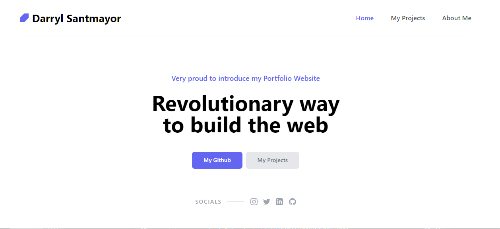

# Portfolio Project by Darryl Santmayor

## What I have learned from this Project [Live Link]()

- Good knowledge on Html and Css
- Learnt how to use Tailwind Css
- Learned how to design and structure websites
---

## Time taken to finish this project

-   8 hours to complete it.

#### Screenshot

